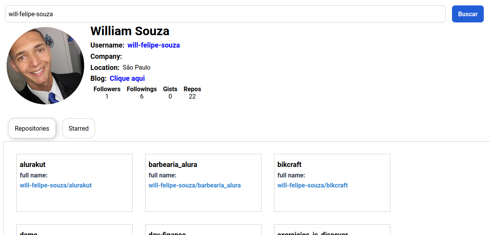

# Interface Github

  <a href="#-tecnologias">Tecnologias</a>&nbsp;&nbsp;&nbsp;|&nbsp;&nbsp;&nbsp;
  <a href="#-projeto">Projeto</a>&nbsp;&nbsp;&nbsp;

 

  

## 🚀 Tecnologias

Esse projeto foi desenvolvido com as seguintes tecnologias:

- HTML
- CSS
- JavaScript
- ReactJS
- Axios

## 💻 Projeto

O projeto tem a finalidade de demonstrar a separação das responsabilidades, uma página totalmente componentizada e cada componente com sua função especifica. O mesmo foi desenvolvido através da plataforma Digital Innovation One, no bootcamp de ReactJS

---

Feito com 💜 👋 [Check out my LinkedIn](https://www.linkedin.com/in/william-souza-0967337b/)